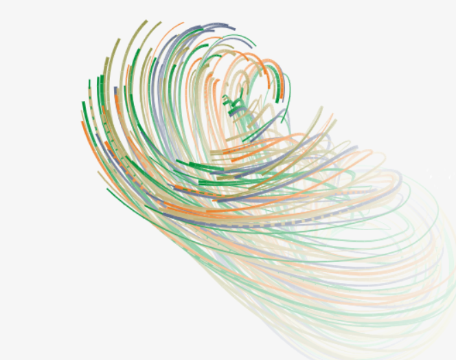

# Circular-Motion-Animation-using-Canvas

        <h1 style="color: #333;">Circular Motion Animation</h1>
 
 
 

This project demonstrates a mesmerizing circular motion animation created using HTML canvas and JavaScript. The animation features colorful lines that emanate from the center and move in circular trajectories, creating an immersive visual experience.

        
   <h2 style="color: #333;">Features:</h2>
        <ul>
            <li><strong>Dynamic Animation:</strong> Lines dynamically move in circular paths, creating a captivating motion effect.</li>
            <li><strong>Randomization:</strong> Randomization is applied to the distance from the center and initial angle of each line, enhancing the visual variety.</li>
            <li><strong>Smooth Rendering:</strong> The animation is rendered smoothly using requestAnimationFrame for optimal performance.</li>
            <li><strong>Interactivity:</strong> The animation canvas reacts to the browser window size changes, ensuring a responsive display across devices.</li>
        </ul>
        <h2 style="color: #333;">Technologies Used:</h2>
        <ul>
            <li><strong>HTML Canvas:</strong> The animation is built using the HTML canvas element, providing a powerful drawing surface.</li>
            <li><strong>JavaScript:</strong> JavaScript is used to define the animation logic, including line movement and rendering.</li>
            <li><strong>CSS:</strong> Minimal CSS styling is applied to the canvas element for layout and responsiveness.</li>
        </ul>
        
   <h2 style="color: #333;">How to Use:</h2>
        <ol>
            <li>Clone the repository to your local machine.</li>
            <li>Open the <code>index.html</code> file in your web browser.</li>
            <li>Experience the mesmerizing circular motion animation!</li>
        </ol>
        
   <h2 style="color: #333;">Credits:</h2>
        <ul>
            <li>This project is inspired by various tutorials and examples of canvas animations available online.</li>
            <li>Special thanks to the contributors of JavaScript and HTML canvas resources that helped in understanding the concepts behind animation.</li>
        </ul>
        
   
Feel free to explore, modify, and integrate this circular motion animation into your projects! 🌟

    

 
